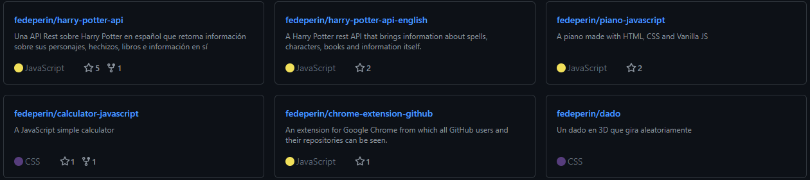

# Github Repo Cards

GitHub Repo Cards are a tool; If you link it via the CDN to your web page, you can add custom and responsive cards like the ones below with just one line of HTML.



## CDN
First, link the CDN by pasting the following two lines at the head tag of your page.

````html
<script src="https://cdn.jsdelivr.net/npm/github-repo-cards@1.0.5/app.js" defer></script>
<link rel="stylesheet" href="https://cdn.jsdelivr.net/npm/github-repo-cards@1.0.5/style.css">
````

## Usage

You can use it, by adding a section tag like the one below at the body tag of your page, and changeing the value of data-user by your github username.

````html
<section class="github-repo-cards" data-user="github"></section>
````

## Parameters

The cards are customizable. You can pass parameters to the section to make changes to the cards.

### data-user

Your GitHub username.

### data-target-blank

You can pass the parameter `data-target-blank` to configure if the links are opened by default in a new tab or not. If you want them to open in a new tab, the value wold be `true`, if not, the value wold be `false`.

### data-background

You can pass the parameter `data-background` to configure the background of the container. The value can be a color in rgb, rgba, hex, hsl, or the name of the color.