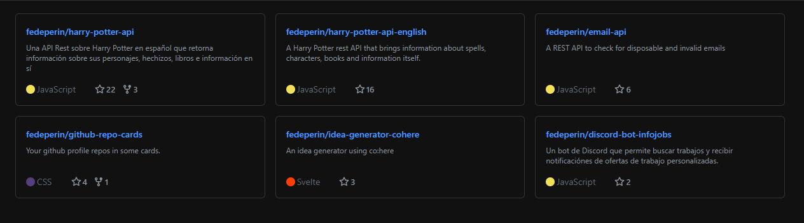

# Github Repo Cards
> [!IMPORTANT]  
> Github Repo Cards is now on it's version 2, it had many breaking changes since version 1. If you want to continue using the old version, please check the [1.0.10 version docs](https://www.npmjs.com/package/github-repo-cards/v/1.0.10)  

Github Repo Cards, the Web Component to show your Github repository cards.



## CDN
First of all, import the web component pasting the following script tag at the head tag of your page.  
````html
<script src="https://cdn.jsdelivr.net/npm/github-repo-cards@1.0.10/app.js" defer></script>
````

## Usage
The way of using it is via the custom element github-repo-cards as in the following example:
````html
<github-repo-cards data-user="fedeperin"></github-repo-cards>
````

## Parameters
The cards are customizable. You can pass parameters to the section to make changes to the cards.

### data-user
Your GitHub username.

### data-target-blank
The parameter `data-target-blank` is to configure if the links are opened by default in a new tab or not. If you want them to open in a new tab, the value should be `true`, else, the value should be `false`.

### data-background
The parameter `data-background` is to configure the background of the container. The value can be a color in rgb, rgba, hex, hsl, or the name of the color (the supported values of the native CSS background).